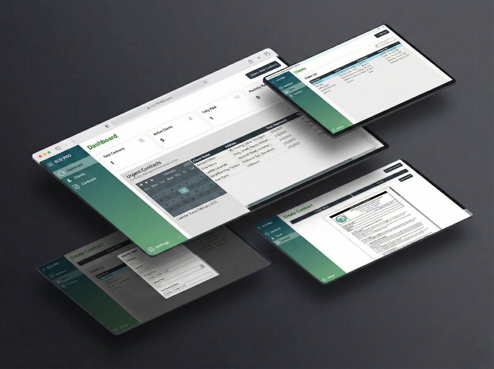
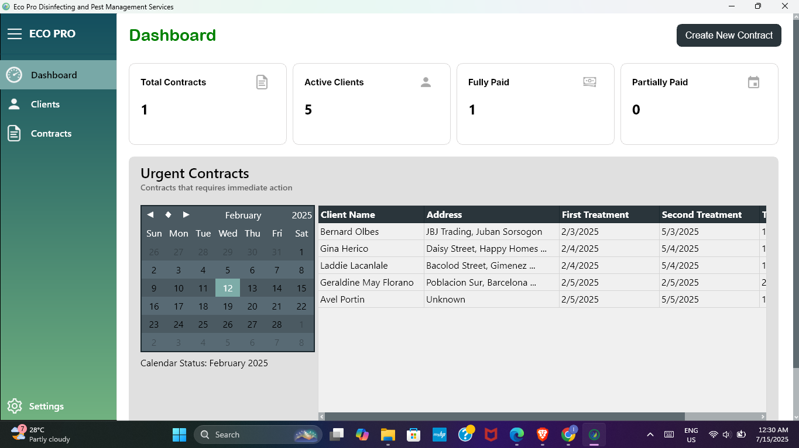
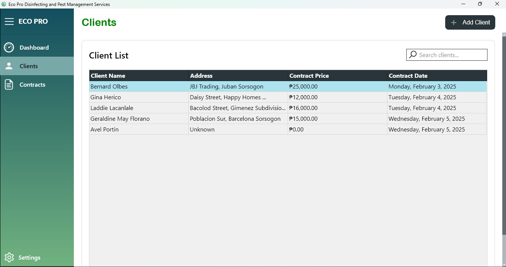
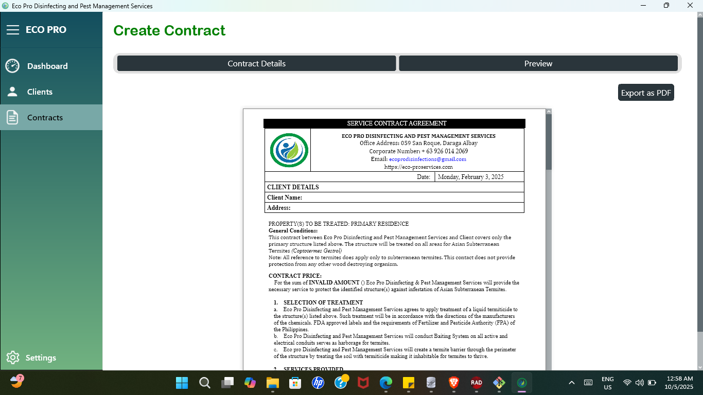

  <h1>📝 Eco Pro Contract Management System</h1>
  <h3>Streamlining Contracts for a Sustainable Future</h3>

  

    A high-performance desktop application built with <b>Delphi FMX</b> to digitize  
    business operations, patient management, and legal document automation.
  

  

    
    
    
    
  

  

 

## 📖 Overview

The **Eco Pro Contract Management System** is a specialized business automation tool developed to modernize the daily operations of service providers. It replaces manual record-keeping with a secure digital environment, allowing for immersive visual experiences and blockchain-ready integration capabilities.

The system focuses on the entire lifecycle of client management—from initial registration and medical history tracking to automated PDF contract generation and multi-phase treatment scheduling.

---

## 🎯 Key Features

| Feature | Description |
| :--- | :--- |
| **📄 Automated PDF Export** | Dynamically populates legal templates with client data and treatment details for instant document generation. |
| **📊 Operational Dashboard** | Tracks "Urgent Contracts" and upcoming treatment schedules (1st, 2nd, and 3rd phases) in real-time. |
| **👥 Client Repository** | A searchable database for managing client profiles, contact information, and detailed service history. |
| **👁️ Document Preview** | Split-screen interface for real-time verification of contract layouts before finalization. |
| **✅ Phase Tracking** | Checkbox-based system to monitor specific service stages, such as initial vs. follow-up treatments. |
| **💰 Payment Monitoring** | Visual status indicators for tracking financial progress (Fully Paid vs. Partially Paid). |

---

## 📸 System Gallery

<table>
  <tr>
    <td width="50%">
      <h3 align="center">Dashboard Analytics</h3>
      
    </td>
    <td width="50%">
      <h3 align="center">Client Logs</h3>
      
    </td>
  </tr>
  <tr>
    <td width="50%">
      <h3 align="center">Add Clients</h3>
      
    </td>
    <td width="50%">
      <h3 align="center">PDF Engine</h3>
      
    </td>
  </tr>
</table>

---

## 🛠️ Technical Stack

* **Language:** Object Pascal (Delphi)
* **Framework:** FireMonkey (FMX)
* **Database:** SQL
* **Output Engine:** Integrated PDF Generation Engine

---

## 🚀 Getting Started

1. **Hardware:** Optimized for Windows-based desktop environments.
2. **Setup:** - Ensure SQL database connectivity is configured in the application settings.
   - Load the relevant contract templates (.pdf or .html) into the `/templates` directory.
3. **Run:** Launch `EcoProCMS.exe` and log in with administrator credentials.

---

  
Developed by <b>Lance Esureña</b>

  

    
    
  

